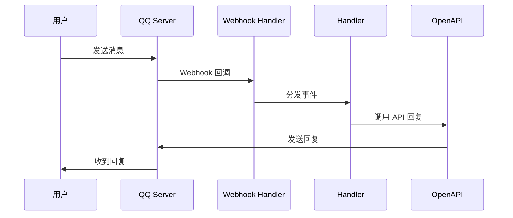
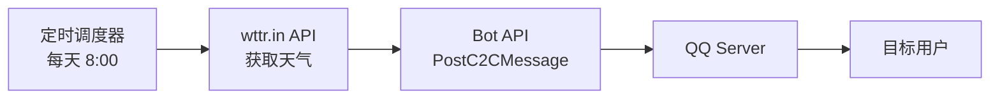

# QQ Bot Projects

基于腾讯 [QQ 机器人 SDK (botgo)](https://github.com/tencent-connect/botgo) 的两个项目。

## 项目结构

```
.
├── qqbotMessage/     # QQ 机器人核心插件
└── weatherPush/      # 定时天气推送服务
```

## qqbotMessage

QQ 机器人核心插件，提供消息处理能力。

### 消息处理流程（被动回复）



### 功能

- **@ 消息处理** - 处理群聊中 @ 机器人的消息
- **私信处理** - 处理用户发送给机器人的私信
- **Webhook 回调** - 通过 HTTP Webhook 接收 QQ 服务器事件

### 启动

```bash
cd qqbotMessage
go run main.go
```

## weatherPush

定时天气推送服务，基于 qqbotMessage 实现。

### 数据流转（主动推送）



### 功能

- **定时推送** - 每日定时获取天气并推送给指定用户
- **天气数据源** - 使用 wttr.in 免费天气 API
- **私信推送** - 通过 C2C 私信方式推送给目标用户

### 配置 (config.yaml)

```yaml
qq:
  appid: "你的AppID"
  secret: "你的Secret"

push:
  user_id: "目标用户ID"
  city: "城市名"
  hour: 8        # 推送小时
  minute: 0      # 推送分钟
```

### 启动

```bash
cd weatherPush
go run main.go
```

## 依赖

| 依赖 | 说明 |
|------|------|
| [botgo](https://github.com/tencent-connect/botgo) | QQ 机器人 SDK |
| [trpc-go](https://github.com/trpc-group/trpc-go) | TRPC 框架 |
| [gopkg.in/yaml.v3](https://gopkg.in/yaml.v3) | YAML 配置文件解析 |
