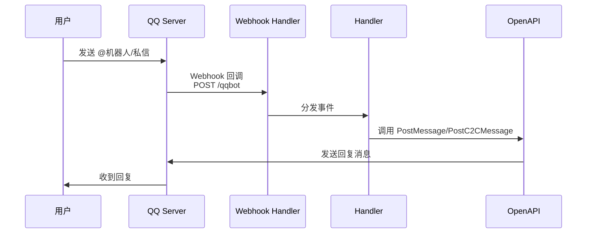
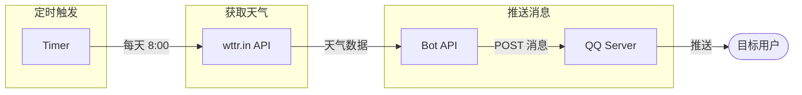

# QQ Bot Projects

基于腾讯 [QQ 机器人 SDK (botgo)](https://github.com/tencent-connect/botgo) 的两个项目。

## 项目结构

```
.
├── qqbotMessage/     # QQ 机器人核心插件
└── weatherPush/      # 定时天气推送服务
```

## 整体架构

```mermaid
flowchart TB
    subgraph QQ["QQ 机器人开放平台"]
        QQServer[QQ Server]
    end

    subgraph qqbotMessage["qqbotMessage 核心插件"]
        Webhook[Webhook 回调]
        ATHandler[@消息处理]
        C2CHandler[私信处理]
    end

    subgraph weatherPush["weatherPush 天气推送"]
        Scheduler[定时调度器]
        WeatherAPI[wttr.in 天气API]
    end

    QQServer -->|1. 消息事件| Webhook
    Webhook --> ATHandler
    Webhook --> C2CHandler
    ATHandler -->|2. 回复消息| QQServer
    C2CHandler -->|2. 回复私信| QQServer

    Scheduler -->|定时触发| WeatherAPI
    WeatherAPI -->|天气数据| Scheduler
    Scheduler -->|调用 API| QQServer
    QQServer -->|推送消息| User[目标用户]
```

## qqbotMessage

QQ 机器人核心插件，提供消息处理能力。

### 消息处理流程



### 功能

| 功能 | 说明 |
|------|------|
| @ 消息处理 | 处理群聊中 @ 机器人的消息 |
| 私信处理 | 处理用户发送给机器人的私信 |
| Webhook 回调 | 通过 HTTP Webhook 接收 QQ 服务器事件 |

### 启动

```bash
cd qqbotMessage
go run main.go
```

## weatherPush

定时天气推送服务，基于 qqbotMessage 实现。

### 数据流转



### 功能

| 功能 | 说明 |
|------|------|
| 定时推送 | 每日定时获取天气并推送给指定用户 |
| 天气数据源 | 使用 wttr.in 免费天气 API |
| 私信推送 | 通过 C2C 私信方式推送给目标用户 |

### 配置 (config.yaml)

```yaml
qq:
  appid: "你的AppID"
  secret: "你的Secret"

push:
  user_id: "目标用户ID"
  city: "城市名"
  hour: 8        # 推送小时
  minute: 0      # 推送分钟
```

### 启动

```bash
cd weatherPush
go run main.go
```

## 依赖

| 依赖 | 说明 |
|------|------|
| [botgo](https://github.com/tencent-connect/botgo) | QQ 机器人 SDK |
| [trpc-go](https://github.com/trpc-group/trpc-go) | TRPC 框架 |
| [gopkg.in/yaml.v3](https://gopkg.in/yaml.v3) | YAML 配置文件解析 |
